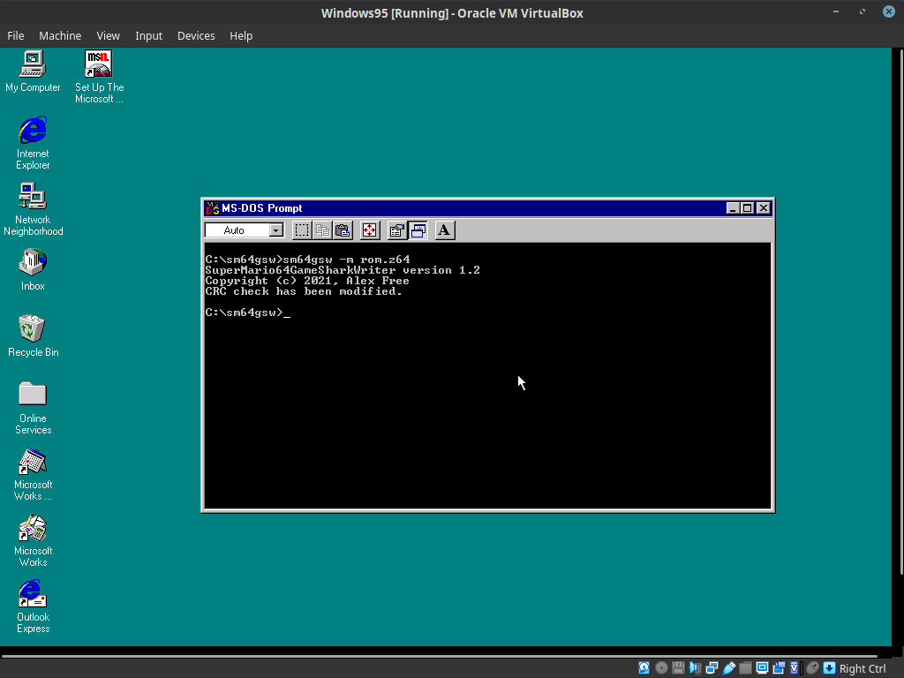
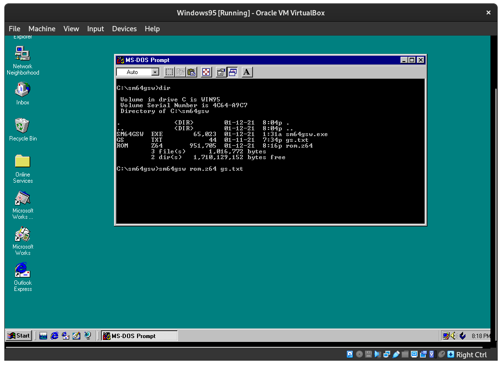
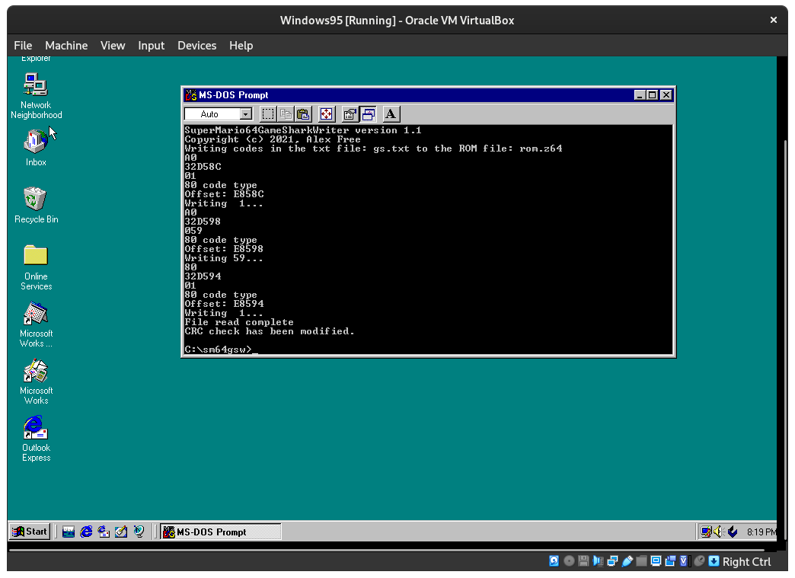
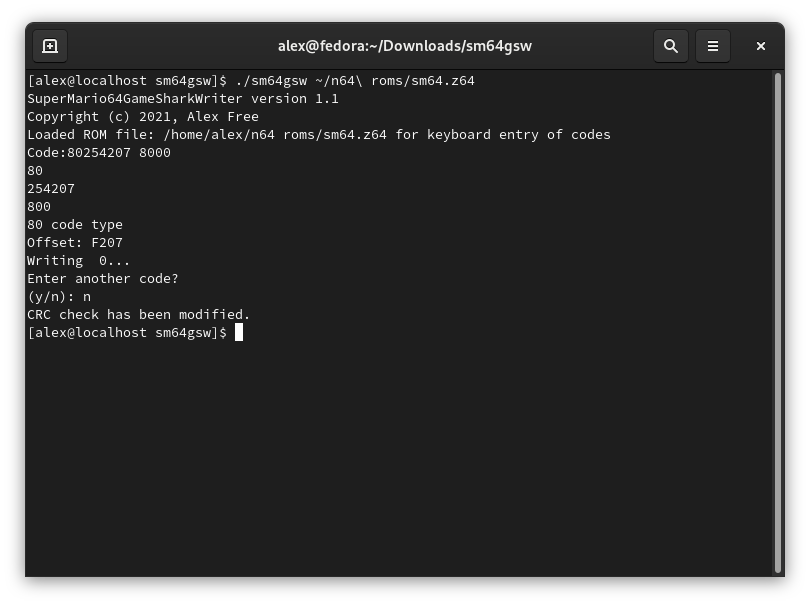

# [alex-free.github.io](https://alex-free.github.io)

# SM64GSW

by Alex Free

SuperMario64GameSharkWriter writes GameShark/Xploder64 codes **into a Super Mario 64 ROM file**, and **patches out the CRC check if necessary** (making this an alternative to the CHKSUM64 program) allowing edited ROMs to boot in [emulators](#empulator-compatibility). Unlike the old `CHKSUM64` program the resulting ROM will work in Mupen64Plus and many other emulators, **as well as real hardware via a flash cart!**

Create rom hacks using gameshark codes or add gameshark codes directly into your hack!

SM64GSW performs Messiaen64's ROM hex editing methods written at [Patching GameShark Codes](https://web.archive.org/web/20201025122720/https://sites.google.com/site/messiaen64/patching-gameshark-codes) and [Getting Rid Of The Checksum Trap](https://web.archive.org/web/20201025122712/https://sites.google.com/site/messiaen64/getting-rid-of-the-checksum-trap) in software automatically so you don't have to hex edit your SM64 ROM manually. You want to use the ROM file most likely named 'Super\_Mario\_64\_\_U\_\_\_\_\_.z64' with this software, although all other regions in the The .z64 rom file type also work.

## Links

* [GitHub](https://github.com/alex-free/sm64gsw)
* [HomePage](https://alex-free.github.io/sm64gsw)

## Table Of Contents

*   [Downloads](#downloads)
*   [GameShark Code Compatibility](#gameshark-code-compatibility)
*   [Emulator Compatibility](#emulator-compatibility)
*   [Usage](#usage)
*   [Patch Out The CIC Check](#patch-out-the-cic-check)
*   [Write GameShark Codes Listed In A TXT File To ROM](#write-gameshark-codes-listed-in-a-txt-file-to-rom)
*   [Type GameShark Codes To ROM](#type-codes-to-rom)
*   [Using The Arg-less Mode](#using-the-arg-less-mode)
*   [Building From Source](#building-from-source)
*   [License](#license)

## Downloads

### Version 1.4 (7/18/2021)

[Mac OS 8-9 PowerPC](https://github.com/alex-free/sm64gsw/releases/download/1.4/sm64gsw_1.4_mac_os_powerpc.sit)

[Mac OS X 10.3.9-10.6.8 PowerPC](https://github.com/alex-free/sm64gsw/releases/download/1.4/sm64gsw_1.4_mac_os_x_powerpc.zip)

[Windows 95 OSR 2.5-Windows 10](https://github.com/alex-free/sm64gsw/releases/download/1.4/sm64gsw_1.4_win32.zip)

[Linux x86](https://github.com/alex-free/sm64gsw/releases/download/1.4/sm64gsw_1.4_linux_x86.zip)

[Linux x86\_64](https://github.com/alex-free/sm64gsw/releases/download/1.4/sm64gsw_1.4_linux_x86_64.zip)

[Source Code](https://github.com/alex-free/sm64gsw/archive/1.4.zip)

[Classic Mac OS Source Code](https://github.com/alex-free/sm64gsw/releases/download/1.4/sm64gsw_1.4_mac_os_source.sit)

View [all releases](https://github.com/alex-free/sm64gsw/releases/).

## GameShark Code Compatibility

The supported codes types are 80, A0, F0, 81, A1, and 2A. Code types are defined by the first 2 hexadecimal digits of a code. For example, in the level select code 'A032D58C 0001' 'A0' is the code type. SM64GSW will not write incompatible code types to the ROM, and it will tell you if this happens. In a multi-line code, this could happen after the first line, which would mean only part of the multi-line code was written to ROM possibly making it unusable. In such a case, you should replace the ROM file.

There is a work in progress [Known Working Codes](https://raw.githubusercontent.com/alex-free/sm64gsw/main/known_working_codes.txt) list. The Supported RAM range is 80246000-80333000. The 3rd-8th digits of a code must be a hexadecimal value in the range of 246000-333000 to work. Not all N64 GameShark/Xploder64 code types are supported. This is due to certain code types not translating into just hex writes for various reasons, such as codes that:

*   Require physical hardware (like a GS button).
*   Perform live checks and or dynamic modification.
*   Expansion pack releated.
*   Non-Super Mario 64 security chip related.

Besides the above limitations, some codes may not work as they normally do so you'll need to just test them out.

## Emulator Compatibility

1964, Mupen64, and Mupen64Plus will run the resulting edited ROMs as normal. Other emulators may display error messages on loading the ROM but still work. Nemu64 0.8 will display an error message "Unknown bootcode. Chances that this game won't work are high". Project 64 1.6 will display two error messages. "Unknown Cic Chip" and "Unhandled CicChip(-1) in first DMA". Other emulators were not tested, but any really should work.

## Usage

Classic Mac OS (Mac OS 9 and below) use the arg-less mode by default. Read the [Using The arg-less Mode](#using-the-arg-less-mode) section to learn how to use this mode on classic mac os, or to use it manually on any other operating system.

This is a command line program, so on Windows you can open command.com or cmd.exe to execute sm64gsw.exe. On other Operating Systems use the Terminal. There are 3 main features.

**Note that if any file paths given to SM64GSW contain any spaces you must escape (\\) the spaces as done in the examples below.**

### Patch Out The CIC Check

This functionallity can be used as an alternative to the CHKSUM64 program. CHKSUM64 will try to correct the CIC check but the ROMs it modifies do not load in all emulators, most notably Mupen64Plus. The method SM64GSW uses will however work in Mupen64Plus and all the emulators CHKSUM64 worked in as well. So if you want to bypass the CIC check in your ROM file and not write any codes, use -m as your first argument, and the ROM file path as the second argument. Note that this function is automatically performed if neccesary when GameShark codes that cause the CIC Check to fail are written to a ROM file by SM64GSW. So you do not need to do this if you are writing codes to a ROM.

#### Examples

`sm64gsw -m rom.z64`

Bypass CIC check in the file "rom.z64".

 

### Write GameShark Codes Listed In A TXT File To ROM

SM64GSW can write GameShark codes listed in a txt file line by line. To do this, you have to provide 3 total arguments to run SM64GSW in txt file mode. The first argument is the ROM file path, the second is the TXT file path. The TXT file should simply list each code line by line. An example of this is the "gs.txt" file within this release.

#### Examples

`sm64gsw rom.z64 codes.txt`

Write all codes found in the `codes.txt` file to the ROM file `rom.z64`

 

 

### Type Codes To ROM

There is an interface to type codes into a ROM as well. To do this, just execute sm64gsw with the ROM file path as the only argument. For multi-line codes, you can enter each code line by line, one at a time.

#### Examples

`sm64gsw rom.z64`

Load the ROM file "rom.z64" for code entry via keyboard.

 

### Using The Arg-less Mode

SM64GSW has an alternative menu interface system that can be used instead of the normal command line arguments. On Classic Mac OS 9 and earlier this mode is the default mode. If your not running classic Mac OS 9 or earlier but want to use arg-less mode, you can manually trigger it with the the command line `-a` argument:

`sm64gsw -a`

**NOTE:** currently when using the arg-less mode, the rom and txt file names must not contain any spaces for sm64gsw to be able to load them.

## Changelog

Version 1.4 - 7/18/2021

*   Classic Mac OS support.
*   SM64GSW now tells you what line an unsupported code is on when reading a .txt file of codes.
*   Added verification and official support of SM64 USA, Japan, PAL, and Shindou edition ROMs in .z64 (big-endian) format.
*   Implemented an arg-less mode. Used by default on classic macos, manually triggerable by `sm64gsw -a`.
*   Added a codes written counter, you can now see how many codes you wrote with SM64GSW automatically.
*   Rewrote input system.
*   Now works on any other not mentioned big endian platform that defines `__BYTE_ORDER__ == BIG_ENDIAN` or `BIG_ENDIAN`.

Version 1.3 - 2/19/2021

*   Finally, Big Endian PowerPC Mac OS X is supported! Other Big Endian platforms are not yet however.

Version 1.2 - 1/22/2021

*   Fixed a bug on opening a ROM file for keyboard entry.

Version 1.1 - 1/13/2021

*   Proper Linux/Unix compatibility.
*   Fixed bug preventing the ROM from being written to on Windows 95.
*   Added a makefile supporting Linux and Windows targets.
*   CIC check skip method has been implemented.
*   New args system.
*   Supports all 8 bit write code types in the supported range.
*   Rewritten known\_working\_codes.txt file.

Version 1.0.1 - 10/8/2020

*   Fixes a bug which prevented codes from being entered by the keyboard, after an invalid code was entered.

## Building From Source

This software is written to run on any ANSI-C platform with a little endian CPU, or Big Endian PowerPC Mac OS X. Builds for PowerPC Mac OS X, Linux and Windows are available. Other Unix-like Operating Systems/platforms should also work (including Intel/ARM Macs). Really, this software is as easy to compile as `gcc sm64gsw.c -o sm64gsw`. A GNU Makefile is provided that will do just that by default, when executing `make`. There are some additional rules to make various tasks easier to accomplish listed below.

Compile a static 32 bit Linux build.

`make linux-static32`

Compile a static 64 bit Linux build.

`make linux-static64`

Cross compile using the i686-w64-mingw32-gcc compiler for Windows 95 and above (requires Internet Explorer 4.0+ to be installed if running on Windows 95).

`make cross-win32`

Compile for Mac OS X 10.3.9-10.6.8 PowerPC (works on Intel up to 10.6.8 if Rosetta is installed)

`make mac-ppc`

Compile on Mac OS 8.6 or 9.x for Mac OS 8.6+ using [Macintosh Programmer's Workshop](https://macintoshgarden.org/apps/macintosh-programmers-workshop).

*   Open `sm64gsw.make` from the Mac OS 9 [source](#downloads) download (should open the MPW shell).
*   Select the `Build` option in the menu bar and then click `Full Build`. Enter `sm64gsw` as the program name.

## License

SM64GSW is released under the 3-BSD license, see the file `license.txt` in each release for more info.