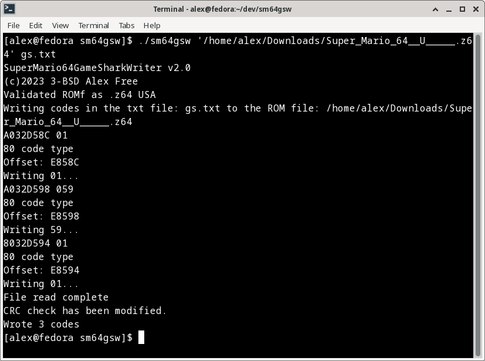

# [alex-free.github.io](https://alex-free.github.io)

# SuperMario64GameSharkWriter 

by Alex Free

SM64GSW writes GameShark/Xploder64 codes directly into a Super Mario 64 ROM file and patches the CRC check allowing it to be played on real hardware (via a flash cart like the ED64Plus) or just about any emulator.

SM64GSW performs Messiaen64's ROM hex editing methods written at [Patching GameShark Codes](https://web.archive.org/web/20201025122720/https://sites.google.com/site/messiaen64/patching-gameshark-codes) and [Getting Rid Of The Checksum Trap](https://web.archive.org/web/20201025122712/https://sites.google.com/site/messiaen64/getting-rid-of-the-checksum-trap) in software automatically so you don't have to hex edit your SM64 ROM manually. You want to use the ROM file most likely named `Super_Mario_64__U_____.z64` with this software, although all other regional releases of SM64 in the the .z64 rom file type also work.

## Links

* [GitHub](https://github.com/alex-free/sm64gsw)
* [HomePage](https://alex-free.github.io/sm64gsw)

## Table Of Contents

*   [Downloads](#downloads)
*   [Usage](#usage)
*   [Building From Source](#building-from-source)
*   [License](#license)

## Downloads

### Version 2.0 (3/29/2023)

*	[sm64gsw-2.0-windows-x86](https://github.com/alex-free/sm64gsw/releases/download/v2.0/sm64gsw-2.0-windows_x86.zip) _For Windows 95 OSR 2.5 Or Newer (32-bit Windows)_
*	[sm64gsw-2.0-windows-x86\_64](https://github.com/alex-free/sm64gsw/releases/download/v2.0/sm64gsw-2.0-windows_x86_64.zip) _For 64-bit Windows_
*	[sm64gsw-2.0-linux-x86](https://github.com/alex-free/sm64gsw/releases/download/v2.0/sm64gsw-2.0-linux_x86_static.zip) _For x86 Linux Distros_
*	[sm64gsw-2.0-linux-x86\_64](https://github.com/alex-free/sm64gsw/releases/download/v2.0/sm64gsw-2.0-linux_x86_64_static.zip) _For x86_64 Linux Distros_
*	[sm64gsw-2.0-source](https://github.com/alex-free/sm64gsw/archive/refs/tags/v2.0.zip)

[About previous versions](changelog.md)

Changes:

*   Fixed a bug introduced in v1.4 that prevented codes from being written to the ROM file correctly (I was so terrible at programming when I wrote this almost 3 years ago).
*   Fixed a bug which could result in an infinite loop while parsing a `.txt` file.
*   Rewrote and optimized basically everything.
*   Removed Big-Endian support.
*   Converted docs to markdown.
*   Linux x86_64 build.
*   Added the `Seaweed Replaced With Water Koopa Shells` code to the [known working codes](known-working-codes.md) list.

## Usage

The first argument is required, it is the `.rom` file to write codes into. The second argument is optional, it can be a  `.txt` file that contains codes, line by line. If you don't provide the second argument, SM64GSW drops into a shell interface that allows you to type in as many codes as you want individually.

 

An example `.txt` file named `gs.txt` is available in each SM64GSW release to show the simple format used.

### Supported GameShark Code Criteria

The supported codes types are `80`, `A0`, `F0`, `81`, `A1`, and `2A`. Code types are defined by the first 2 hexadecimal digits of a code. For example, in the level select code `A032D58C 0001` `A0` is the code type. 

SM64GSW will not write incompatible code types to the ROM, and it will tell you if this happens. In a multi-line code, this could happen after the first line, which would mean only part of the multi-line code was written to ROM possibly making it unusable. In such a case, you should replace the ROM file if you don't get the results you want.

There is a work in progress [Known Working Codes](known-working-codes.md) list.

According to the original Messiaen64 method, only codes within the supported RAM range of 80246000-80333000 will work, as in the 3rd-8th digits of a code must be a hexadecimal value in the range of 246000-333000. I haven't really found this to be the case, some codes outside of this range do work. So SM64GSW only displays a warning if a code modifies RAM outside of this address range.

Besides the above limitations, some codes may not work as they normally do so you'll need to just test them out.

### Using SM64GSW Edited ROMs

1964, Mupen64, and Mupen64Plus will run the resulting edited ROMs as normal. Other emulators may display error messages on loading the ROM but still work. 

Nemu64 0.8 will display an error message "Unknown bootcode. Chances that this game won't work are high". Project 64 1.6 will display two error messages. "Unknown Cic Chip" and "Unhandled CicChip(-1) in first DMA". Project 64 v3.0 shows no such messages. Other emulators were not tested, but any really should work.

Flash carts on real N64 hardware also work just fine! This has been tested on an ED64Plus.

## Building From Source

[Download](#downloads) the source, cd into it, and type `make`.

## License

SM64GSW is released under the 3-BSD license, see the file `license.txt` in each release for more info.